# Database Entity-Relationship Diagram

## Full ERD

```mermaid
erDiagram
    %% ============ CORE: Auth & Player ============
    accounts {
        VARCHAR account_id PK
        VARCHAR account_type "guest, google, apple, linked"
        VARCHAR status "active, banned, deleted, pending_deletion"
        VARCHAR primary_player_id FK
        VARCHAR role "player, admin"
        TIMESTAMP created_at
        TIMESTAMP last_login_at
        TIMESTAMP deleted_at
    }

    auth_identities {
        VARCHAR identity_id PK
        VARCHAR account_id FK
        VARCHAR provider "guest, google, apple"
        VARCHAR provider_user_id UK
        VARCHAR email_hash
        TIMESTAMP created_at
        TIMESTAMP last_used_at
    }

    player_profiles {
        VARCHAR player_id PK
        VARCHAR account_id FK
        VARCHAR display_name
        INT level
        INT exp
        INT coin
        INT gem
        TIMESTAMP created_at
        TIMESTAMP last_login_at
    }

    %% ============ INVENTORY & ECONOMY ============
    player_characters {
        VARCHAR player_id PK "FK to player_profiles"
        VARCHAR character_id PK
        INT level "default 1"
        INT exp "cumulative"
        INT stat_points "unspent points"
        INT bonus_hp
        INT bonus_damage
        INT bonus_mobility
        INT bonus_defense
        INT bonus_skill_power
        INT bonus_terrain_damage
        TIMESTAMP unlocked_at
    }

    inventory_items {
        VARCHAR player_id PK "FK to player_profiles"
        VARCHAR item_id PK
        INT quantity
        VARCHAR source
        TIMESTAMP acquired_at
        TIMESTAMP expires_at
    }

    inventory_reservations {
        VARCHAR reservation_id PK
        VARCHAR player_id FK
        VARCHAR match_id
        VARCHAR item_id
        INT quantity
        VARCHAR status "reserved, consumed, released"
        TIMESTAMP created_at
        TIMESTAMP updated_at
    }

    economy_transactions {
        VARCHAR transaction_id PK
        VARCHAR player_id FK
        VARCHAR currency "coin, gem"
        INT amount
        INT balance_after
        VARCHAR source "match_reward, mission, iap, gift_code, shop_purchase, refund"
        VARCHAR ref_id
        TIMESTAMP created_at
    }

    player_loadouts {
        VARCHAR player_id PK "FK to player_profiles"
        VARCHAR character_id "default: rookie"
        JSONB items "max 3 items"
        TIMESTAMP updated_at
    }

    %% ============ SHOP & IAP ============
    shop_offers {
        VARCHAR offer_id PK
        VARCHAR item_id
        VARCHAR offer_type "item, character_unlock, bundle"
        VARCHAR price_currency "coin, gem"
        INT price_amount
        INT quantity
        INT limit_per_player
        BOOLEAN is_active
        TIMESTAMP starts_at
        TIMESTAMP ends_at
    }

    shop_purchases {
        VARCHAR purchase_id PK
        VARCHAR player_id FK
        VARCHAR offer_id FK
        VARCHAR price_currency
        INT price_amount
        INT quantity_granted
        VARCHAR status "completed, failed, refunded"
        TIMESTAMP created_at
    }

    iap_products {
        VARCHAR product_id PK
        JSONB platform_sku_id
        INT gem_amount
        INT bonus_gem_amount
        NUMERIC price_usd
        BOOLEAN is_active
    }

    payment_transactions {
        VARCHAR transaction_id PK
        VARCHAR player_id FK
        VARCHAR product_id FK
        VARCHAR platform "android, ios"
        TEXT purchase_token
        NUMERIC amount_usd
        INT gem_granted
        VARCHAR status "pending, verified, failed, refunded"
        TIMESTAMP created_at
        TIMESTAMP verified_at
        TIMESTAMP refunded_at
    }

    %% ============ GIFT CODES ============
    gift_codes {
        VARCHAR code PK
        INT reward_coin
        INT reward_gem
        JSONB reward_items
        INT max_uses
        INT used_count
        TIMESTAMP expired_at
        BOOLEAN is_active
    }

    gift_code_redemptions {
        VARCHAR player_id PK "FK to player_profiles"
        VARCHAR code PK "FK to gift_codes"
        TIMESTAMP redeemed_at
    }

    %% ============ MISSIONS ============
    missions {
        VARCHAR mission_id PK
        VARCHAR type "daily, achievement"
        VARCHAR target "play_match, win_match, damage_dealt, ..."
        INT required_value
        INT reward_coin
        INT reward_gem
        JSONB reward_items
        BOOLEAN is_active
    }

    mission_progress {
        VARCHAR player_id PK "FK to player_profiles"
        VARCHAR mission_id PK "FK to missions"
        INT current_value
        BOOLEAN is_claimed
        TIMESTAMP updated_at
    }

    %% ============ RANKING ============
    rank_seasons {
        VARCHAR season_id PK
        VARCHAR name
        TIMESTAMP starts_at
        TIMESTAMP ends_at
        VARCHAR status "upcoming, active, ended, reward_granting, closed"
    }

    player_ranks {
        VARCHAR player_id PK "FK to player_profiles"
        VARCHAR season_id PK "FK to rank_seasons"
        INT rating "default: 1000"
        VARCHAR tier "bronze~master"
        INT division "1-3"
        INT wins
        INT losses
        INT draws
        INT win_streak
        VARCHAR highest_tier
        TIMESTAMP updated_at
    }

    season_reward_claims {
        VARCHAR claim_id PK
        VARCHAR player_id FK
        VARCHAR season_id FK
        VARCHAR tier
        INT reward_coin
        INT reward_gem
        JSONB reward_items
        TIMESTAMP claimed_at
    }

    %% ============ MATCH HISTORY ============
    match_histories {
        VARCHAR match_id PK
        VARCHAR player_id PK "FK to player_profiles"
        VARCHAR mode "pvp_1v1, pvp_2v2, ranked_2v2"
        VARCHAR map_id
        VARCHAR result "win, loss, draw, no_contest"
        INT damage
        INT kills
        NUMERIC accuracy
        INT exp_gained
        INT coin_gained
        TIMESTAMP played_at
    }

    match_snapshots {
        VARCHAR match_id PK
        VARCHAR room_id
        VARCHAR server_node_id
        INT turn_index
        VARCHAR current_player_id
        INT snapshot_version
        JSONB state_blob
        BYTEA terrain_blob
        VARCHAR checksum
        TIMESTAMP created_at
    }

    match_recovery_logs {
        VARCHAR log_id PK
        VARCHAR match_id
        INT event_seq UK
        VARCHAR event_type
        JSONB event_payload
        TIMESTAMP created_at
    }

    match_event_logs {
        BIGINT id PK
        TEXT match_id
        BIGINT seq
        TEXT event_type
        TEXT player_id
        JSONB data
        TIMESTAMP created_at
    }

    %% ============ MODERATION ============
    player_reports {
        VARCHAR report_id PK
        VARCHAR reporter_player_id FK
        VARCHAR target_player_id FK
        VARCHAR match_id
        VARCHAR category "cheat, abuse, afk, payment_fraud, other"
        TEXT description
        VARCHAR status "open, reviewing, actioned, rejected"
        TIMESTAMP created_at
        TIMESTAMP reviewed_at
        VARCHAR reviewed_by
    }

    account_bans {
        VARCHAR ban_id PK
        VARCHAR account_id FK
        VARCHAR player_id FK
        VARCHAR reason_code
        TEXT reason_text
        VARCHAR source "anti_cheat, moderator, payment_fraud, system"
        TIMESTAMP starts_at
        TIMESTAMP ends_at "NULL = permanent"
        VARCHAR status "active, expired, revoked"
        VARCHAR evidence_ref_id
        TIMESTAMP created_at
    }

    %% ============ APP CONFIG ============
    client_version_policies {
        VARCHAR platform PK "android, ios"
        VARCHAR min_supported_version
        VARCHAR latest_version
        INT protocol_version
        BOOLEAN force_update
        TEXT soft_update_message
        VARCHAR store_url
        TIMESTAMP updated_at
    }

    game_settings {
        TEXT key PK
        TEXT value
        TEXT value_type "number, json, string"
        TEXT description
        TEXT category "general, matchmaking"
        TIMESTAMP updated_at
    }

    %% ============ GAME CONFIG (Admin) ============
    config_characters {
        TEXT character_id PK
        TEXT name
        TEXT role
        INT hp
        INT damage
        INT mobility
        INT defense
        INT skill_power
        INT terrain_damage
        INT difficulty
        TEXT weapon_id
        TEXT skill_id
        TEXT description
    }

    config_weapons {
        TEXT weapon_id PK
        TEXT name
        INT damage
        INT explosion_radius
        INT terrain_damage
        FLOAT projectile_weight
        FLOAT wind_influence
        INT multi_hit
        TEXT description
    }

    config_skills {
        TEXT skill_id PK
        TEXT character_id
        TEXT name
        INT cooldown_turn
        TEXT effect_type
        INT projectile_count
        TEXT status_effect_id
        FLOAT damage_multiplier
        TEXT description
    }

    config_items {
        TEXT item_id PK
        TEXT name
        TEXT type
        TEXT target_type
        FLOAT value
        INT max_use_per_match
        INT cooldown
        TEXT description
    }

    config_maps {
        TEXT map_id PK
        TEXT name
        INT width
        INT height
        JSONB default_wind_power_range
        JSONB terrain_layers
        JSONB spawn_points
        TEXT description
    }

    %% ============ RELATIONSHIPS ============

    %% Auth & Player
    accounts ||--o{ auth_identities : "has"
    accounts ||--o| player_profiles : "owns"

    %% Player → Inventory & Economy
    player_profiles ||--o{ player_characters : "unlocks"
    player_profiles ||--o{ inventory_items : "owns"
    player_profiles ||--o{ inventory_reservations : "reserves"
    player_profiles ||--o{ economy_transactions : "transacts"
    player_profiles ||--o| player_loadouts : "has loadout"

    %% Shop & IAP
    player_profiles ||--o{ shop_purchases : "buys"
    shop_offers ||--o{ shop_purchases : "purchased as"
    player_profiles ||--o{ payment_transactions : "pays"
    iap_products ||--o{ payment_transactions : "for product"

    %% Gift Codes
    player_profiles ||--o{ gift_code_redemptions : "redeems"
    gift_codes ||--o{ gift_code_redemptions : "redeemed as"

    %% Missions
    player_profiles ||--o{ mission_progress : "progresses"
    missions ||--o{ mission_progress : "tracked by"

    %% Ranking
    player_profiles ||--o{ player_ranks : "ranked in"
    rank_seasons ||--o{ player_ranks : "has rankings"
    player_profiles ||--o{ season_reward_claims : "claims"
    rank_seasons ||--o{ season_reward_claims : "rewards from"

    %% Match History
    player_profiles ||--o{ match_histories : "played"

    %% Moderation
    player_profiles ||--o{ player_reports : "reports (reporter)"
    player_profiles ||--o{ player_reports : "reported (target)"
    accounts ||--o{ account_bans : "banned"
    player_profiles ||--o{ account_bans : "banned player"
```

## Domain Groups

| Group | Tables | Purpose |
|-------|--------|---------|
| **Auth & Player** | `accounts`, `auth_identities`, `player_profiles` | Authentication, player identity |
| **Inventory & Economy** | `player_characters`, `inventory_items`, `inventory_reservations`, `economy_transactions`, `player_loadouts` | Items, currency, loadout selection |
| **Shop & IAP** | `shop_offers`, `shop_purchases`, `iap_products`, `payment_transactions` | In-game shop, real-money purchases |
| **Gift Codes** | `gift_codes`, `gift_code_redemptions` | Promotional codes |
| **Missions** | `missions`, `mission_progress` | Daily/achievement quests |
| **Ranking** | `rank_seasons`, `player_ranks`, `season_reward_claims` | Elo rating, tiers, seasonal rewards |
| **Match** | `match_histories`, `match_snapshots`, `match_recovery_logs`, `match_event_logs` | Match results, crash recovery, event audit |
| **Moderation** | `player_reports`, `account_bans` | Player reports, ban enforcement |
| **App Config** | `client_version_policies`, `game_settings` | Version policy, matchmaking/elo/bot config |
| **Game Config** | `config_characters`, `config_weapons`, `config_skills`, `config_items`, `config_maps` | Static game data (admin-editable) |

## Key Relationships

- `player_profiles` is the **central entity** — referenced by 14 other tables
- `accounts` → `auth_identities` (1:N) — one account can have multiple login providers
- `accounts` → `player_profiles` (1:1) — one player per account
- `player_profiles` → `player_loadouts` (1:1) — one loadout per player (shared across modes)
- `player_ranks` has **composite PK** `(player_id, season_id)` — one rank record per season
- `inventory_reservations` holds items during active matches; status transitions: `reserved → consumed/released`
- `game_settings` stores matchmaking config (`matchmaking`, `elo`, `bot_difficulty` keys) as JSON values
